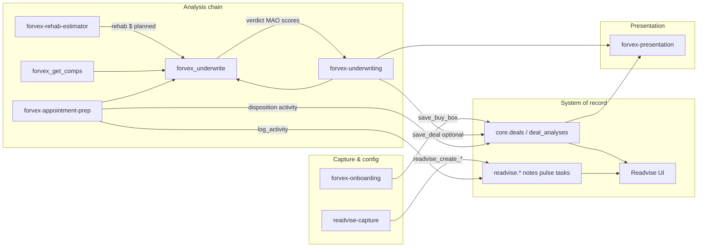

# REcosystem Skill + MCP Interaction Contract

**Status:** Canonical horizontal contract  
**Version:** 1.1.0  
**Governs:** Cross-skill identity, source-of-truth, enums, MCP topology, write discipline, routing, and change protocol  
**Does not govern:** Vertical skill workflows (`redeal-mobile/skills/ARCHITECTURE.md`), per-tool wire schemas (`redeal-mobile/docs/comps_v2_contract.md`), or underwriting math internals

---

## Purpose

This document is a **registry of names, ownership, and pointers**. It prevents horizontal drift: duplicate IDs, recomputed numbers, enum forks, write collisions, and ambiguous skill routing.

**Hard rule:** Do not copy authoritative **values** (rates, thresholds, fee schedules, tier $/sqft figures) into this file or into skill prose when MCP is connected. Name the value and point to its server-side definition.

---

## 1. Identity model

### 1.1 Canonical namespaces

| Name | Type | Minted by | Stored in | Used by MCP as |
|------|------|-----------|-----------|----------------|
| `workspace_id` | UUID | Core workspace provisioning | `core.workspaces` | Optional arg; resolved from membership if omitted |
| `property_id` | UUID | `core.upsert_property` | `core.properties.id` | `forvex_get_property`, `forvex_save_deal`, comps, market |
| `deal_id` | UUID | `core.save_deal_analysis` RPC | **`core.deals.id`** | `forvex_get_deal`, `forvex_save_deal`, `forvex_update_deal_disposition`, planned rehab save |
| `readvise_property_id` | UUID | Readvise property create | `readvise.readvise_properties.id` | `readvise_*` tools; optional bridge on `forvex_get_deal` |
| `trace_id` | string | Comp pipeline persist | `core.comp_traces` | `forvex_get_comp_detail`, `trace_ref.id` on comps output |

**Vertical reference:** `reecosystem-core/ARCHITECTURE.MD` § Canonical IDs & Cross-App Linking

### 1.2 Resolving entities in skills

**Property by address:**

1. Call `forvex_get_property({ address })` → `property_id`
2. Never mint a new property ID in skill prose

**Deal by property:**

1. `forvex_list_deals({ property_id })` → `deal_id` (core)
2. If multiple, ask user; do not silently pick

**Readvise property by nickname/address:**

1. `readvise_resolve_property({ query })` → `readvise_property_id`
2. For forvex deal context on same address, use `property_id` path above

**Pick up prior analysis:**

1. `forvex_get_deal({ id: deal_id })` + optional `forvex_get_deal_history({ deal_id })`

### 1.3 `core.deal_links` mapping

Cross-app deal IDs link to the canonical lifecycle spine:

```
core.deal_links(
  workspace_id,
  source_app,      -- e.g. 'redeal'
  source_deal_id,  -- app-local deal UUID/text
  canonical_deal_id -- → core.deals.id
)
```

- **Unique key:** `(workspace_id, source_app, source_deal_id)`
- **Read path:** `forvex_list_deals` joins `source_app='redeal'` to enrich ARV/score from `redeal.deals` (`recontrol/lib/mcp/deals/listDeals.ts`)
- **Write path:** No MCP tool writes `deal_links` today; linkage is maintained by Core/projector logic

**Companion table:** `core.property_links` — same pattern for property IDs (not yet used in skill flows).

### 1.4 Rehab CONCEPT §9.3 — resolved

**Question:** Is `deal_id` the Readvise deal id?

**Answer:** **No.** `deal_id` in all `forvex_*` write/read tools is **`core.deals.id`**. Readvise pipeline records use `readvise_property_id`. Legacy `redeal.deals.id` maps via `deal_links.canonical_deal_id`. Planned `save_rehab_estimate({ deal_id })` uses **`core.deals.id`**; server projects to domain tables.

### 1.5 MCP topology decision (rehab)

**Decision:** Extend the **recontrol MCP** (`https://control.forvex.app/api/mcp`) with rehab tools — do **not** stand up a separate rehab MCP connector.

**Rationale:** One OAuth surface, one `deal_id` namespace, shared auth (`forvex-rehab-estimator/CONCEPT.md` §3, §9.1).

---

## 2. Source-of-truth registry

**Rule for all consumers:** **Reference, never recompute.** Quote engine fields; do not derive competing numbers in skill prose or local scripts when MCP is connected.

| Value | Producing tool / engine | Primary consumers | Pointer |
|-------|-------------------------|-------------------|---------|
| ARV (median) | `forvex_get_comps` → consumed by `forvex_underwrite` | underwriting, appointment-prep, presentation | `recontrol/lib/mcp/comps/trace/`; `redeal-mobile/docs/comps_v2_contract.md` |
| As-is value | `forvex_get_comps` (`as_is_value`) | comps viz; future underwriting context | `recontrol/lib/mcp/comps/mapGetCompsV2Output.ts` |
| Rehab (runtime input) | User override OR `forvex_underwrite` resolution OR planned `estimate_rehab_*` | underwriting, appointment-prep | `recontrol/lib/mcp/underwrite/runUnderwrite.ts` |
| Rehab (persisted) | Planned `save_rehab_estimate` | `forvex_get_deal`, underwriting re-run | `redeal-mobile/skills/MCP_BUILD_INVESTIGATION.md` |
| Rent | `forvex_get_rent_estimate` + `forvex_underwrite` merge | rental, BRRRR strategies | `recontrol/lib/mcp/rent/` |
| Resolved buy-box | `forvex_get_buy_box` injected in `forvex_underwrite` | all analysis skills | `recontrol/lib/mcp/buybox/` |
| MAO / pre-offer | `forvex_underwrite` | underwriting, appointment-prep | `recontrol/lib/mcp/underwrite/nativeEngine.ts` |
| Verdict | `forvex_underwrite` | all analysis skills | `recontrol/lib/mcp/underwrite/contracts.ts` (`UnderwriteSummarySchema`) |
| deal_score (per strategy) | `forvex_underwrite` | one-pager, save snapshot | Same |
| best_strategy | `forvex_underwrite` | presentation, saves | Same |
| Comps confidence | `forvex_get_comps` (`arv.confidence`) | skill narrative (comps context only) | `recontrol/lib/mcp/comps/trace/compTraceTypes.ts` |
| Underwriting confidence | `forvex_underwrite` (`confidence`) | one-pager | `UnderwriteSummarySchema` — **distinct from comps confidence** |
| Market briefing | `forvex_get_market_intelligence` | appointment-prep narrative | `recontrol/lib/mcp/market/` |
| Saved analysis snapshot | `forvex_save_deal` → `core.deal_analyses` | `forvex_get_deal`, Readvise UI | `recontrol/lib/mcp/deals/saveDeal.ts` |
| Cross-lane event ledger | Cowork lanes via the emit tool (planned) → `core.lane_events` | Readvise reasoning layer (proposes only) | `recontrol/supabase/migrations/20260625130000_core_lane_events.sql`; `recontrol/docs/EVENT_LEDGER_STEP1_BRIEF.md` |

**Offline fallback:** `redeal-mobile/skills/forvex-underwriting/scripts/underwrite.py` may run only when MCP is unreachable. It is **not** a second producer when connected.

**Anti-pattern (explicit):** Passing `include_comps: true` and recomputing ARV in the skill violates `comps_v2_contract.md` design principle.

---

## 3. Canonical enums

Each enum is listed by **name only**. Values and rates live at the pointer.

### 3.1 Strategy taxonomy

**Standard names (display order):** Assignment, Wholesale, Wholetail, Retail Flip, Rental, BRRRR

**Wire keys:** `assignment`, `wholesale`, `wholetail`, `retail_flip`, `rental`, `brrrr`

| Authority | Pointer |
|-----------|---------|
| MCP / server | `recontrol/lib/mcp/buybox/constants.ts` → `FORVEX_STRATEGY_KEYS`, `FORVEX_STRATEGY_LABELS` |
| Zod | `recontrol/lib/mcp/underwrite/contracts.ts` → `ForvexStrategyKeySchema` |
| Readvise UI (mirror) | `readvise/lib/types/preferences.ts` → `FORVEX_STRATEGY_*` (must stay in sync manually until shared package exists) |

### 3.2 Rehab condition tiers (underwriting / quick estimate)

**Wire keys:** `light`, `medium`, `heavy`, `gut`

| Authority | Pointer |
|-----------|---------|
| Underwriting input | `recontrol/lib/mcp/underwrite/contracts.ts` → `rehab_tier` |
| Tier rate table + pre-offer math | `recontrol/lib/mcp/underwrite/nativeEngine.ts` → `DEFAULTS.rehab_per_sqft` |
| Orchestrator merge | `recontrol/lib/mcp/underwrite/runUnderwrite.ts` → `REHAB_PER_SQFT` |

**Separate domain:** REbuild component conditions (`none`, `light`, `medium`, `heavy` per category) — `REbuild3/rebuild3/lib/engine/types.ts`. Map at MCP boundary when rehab tools ship; do not merge enums in skill prose.

### 3.3 Confidence labels (do not conflate)

| Domain | Enum name | Pointer |
|--------|-----------|---------|
| Comps | `CompConfidenceLabel` | `recontrol/lib/mcp/comps/trace/compTraceTypes.ts` |
| Underwriting summary | `confidence` on underwrite output | `recontrol/lib/mcp/underwrite/contracts.ts` |
| Rent estimate | provider passthrough | `recontrol/lib/mcp/rent/loadRentEstimate.ts` |

### 3.4 Deal lifecycle status (write-back)

**Enum name:** `DealLifecycleStatus`

**Pointer:** `recontrol/lib/mcp/deals/dealWritebackTypes.ts` → `DEAL_LIFECYCLE_STATUSES`

Used by: `forvex_update_deal_disposition`, `forvex_save_deal` (initial status only)

### 3.5 Lane event taxonomy (cross-lane ledger)

Two **frozen** enums on `core.lane_events`; the `lane` and `verb` columns are deliberately
**not** enums (text, validated at the emit-tool boundary so a new lane/verb needs no migration).

| Field | Values | Authority |
|-------|--------|-----------|
| `entity_type` | `property`, `deal` (canonical-spine entities only; new types added when their spine exists) | `recontrol/supabase/migrations/20260625130000_core_lane_events.sql` (CHECK) |
| `status` | `proposed`, `confirmed`, `actioned`, `dismissed` (default `proposed` — human-in-the-loop gate) | Same |

**Emit rule (identity discipline):** a lane MUST resolve to a canonical `property_id` / `deal_id`
via `forvex_get_property` before emitting; a free-text address is **never** an entity key on the
ledger. The FK columns enforce this structurally (see §1.2 resolution rules).

---

## 4. MCP topology

| Item | Value |
|------|-------|
| Server host | **recontrol** — `app/api/[transport]/route.ts` |
| Production URL | `https://control.forvex.app/api/mcp` |
| Server name / version | `recontrol-mcp` / `0.3.0` |
| Tool registry | `recontrol/lib/mcp/tools/registry.ts` |
| Output schemas | `recontrol/lib/mcp/tools/outputSchemas.ts` |
| Auth | OAuth 2.1 + PKCE **or** Supabase JWT (dev); per-request user RLS client |
| Connectors | **One** connector per franchisee ("forVEX Control") |
| Readvise capture tools | Same server (`readvise_*` prefix) — not a separate MCP |
| Rehab tools (planned) | Same server — **not** a separate MCP |

**Tool inventory:** See discovery doc §3 or `registry.ts`. Count: 23 registered tools today.

**Resources (presentation):** `forvex://deal/{deal_id}/analysis` etc. — planned; not in registry yet (`forvex-presentation/SKILL.md`).

---

## 5. Data-flow / handoff map



**Handoff rules:**

1. **Rehab → underwriting:** Pass `rehab` or `rehab_override` into `forvex_underwrite`; never re-run strategy math in skill prose.
2. **Comps → underwriting:** ARV flows through `forvex_underwrite` internal comps pull; skill calls `forvex_get_comps` only for explicit comp inspection.
3. **Underwriting → appointment-prep:** Prep consumes `forvex_underwrite` output; does not call `forvex_save_deal`.
4. **All → Readvise:** Operational capture via `readvise-capture`; deal analysis persistence via `forvex_save_deal`; activity notes via `forvex_log_activity`.
5. **Buy-box → all analysis:** Resolved inside `forvex_underwrite`; onboarding writes via `forvex_save_buy_box`.

---

## 6. Write discipline

### 6.1 Shared rules

| Rule | Applies to |
|------|------------|
| **Explicit user confirmation** before any write | All write tools except `quick:` opt-out on capture |
| **Idempotency key** when retry-safe | `forvex_save_deal` (`idempotency_key` UUID) |
| **Verify after write** | `forvex_get_deal` after save; `readvise_get_today_summary` after capture |
| **No silent overwrites** | `forvex_save_deal` appends analysis; disposition is separate tool |
| **`source` field required** | `forvex_save_deal` — skill name string |
| **`calc_version` on engine outputs** | `forvex_underwrite`, planned rehab estimates |
| **`schema_version` on comps outputs** | `forvex_get_comps` → `comps.v2` |

### 6.2 Field ownership (no clobber)

| Field / concern | Owner tool | Table / field | Others |
|-----------------|------------|---------------|--------|
| Analysis snapshot | `forvex_save_deal` | `core.deal_analyses.analysis` | Read-only via `forvex_get_deal` |
| Lifecycle status | `forvex_update_deal_disposition` | `core.deals.current_status` | **`forvex_save_deal` must not change status on re-save** |
| Franchisee prefs | `forvex_save_buy_box` | `core.franchisee_prefs` | `forvex_get_buy_box` read |
| Activity / walkaway notes | `forvex_log_activity` | `readvise.readvise_property_notes` | Append-only |
| Pulse / tasks / advisor | `readvise_create_*`, `readvise_append_pulse_today` | `readvise.*` | Independent of deal analysis |
| Rehab estimate (planned) | `save_rehab_estimate` | `redeal.deals.*_rehab_estimate` (projected) | Must coordinate with analysis.rehab on save — server merges |
| Comp trace | `forvex_get_comps` (side effect) | `core.comp_traces` | Read via `forvex_get_comp_detail` |
| Research attachments | `forvex_attach_analysis` | `core.property_research` | Deduped by hash |

### 6.3 Buy-box precedence (connected runs)

1. Server `forvex_get_buy_box` / injection in `forvex_underwrite`
2. User override this turn (explicit)
3. `my-buy-box.md` project file — **offline/export fallback only** (`FORVEX_MULTI_REPO_REFACTOR_BRIEF.md` § Phase 6)

---

## 7. Skill routing & precedence

### 7.1 Skill registry

| Skill | Primary triggers | Writes |
|-------|------------------|--------|
| `forvex-onboarding` | "set up my buy-box", "onboard me", "update my preferences" | `forvex_save_buy_box` |
| `forvex-underwriting` | "analyze", address + price/ARV/rehab, MAO, what-ifs | `forvex_save_deal` (optional) |
| `forvex-appointment-prep` | "prep me", "meeting at", "appointment brief" | disposition, activity |
| `forvex-rehab-estimator` | "estimate rehab", walkthrough, component mode | `save_rehab_estimate` (planned) |
| `readvise-capture` | "note that", "add a task", "pulse:", "advisor lane:", `quick:` | `readvise_*` |
| `forvex-presentation` | "dashboard", "deck", "PDF" | none |

### 7.2 Disambiguation order

1. **Explicit prefixes:** `quick:`, `pulse:`, `advisor lane:` → readvise-capture
2. **Record vs analyze:** Factual logging → capture; numeric verdict → underwriting / prep
3. **"Rehab" + walkthrough/estimate** → rehab-estimator (when live); rehab as underwriting input → underwriting
4. **"Prep" / "meeting" / "seller"** → appointment-prep over underwriting
5. **"Save" + deal/analysis context** → underwriting (`forvex_save_deal`); "save" + note/task → capture
6. **Presentation keywords** → presentation (requires prior analysis)
7. **Default tie-break:** Prefer read-only path until user confirms writes

---

## 8. Versioning & change protocol

### 8.1 Version fields

| Field | Where set | Bump when |
|-------|-----------|-----------|
| `TOOL_SCHEMA_VERSION` | `recontrol/lib/mcp/constants.ts` | Any breaking MCP wire shape |
| `calc_version` | Underwrite / rehab engines | Formula, threshold, or default change |
| `schema_version` | Comps trace (`comps.v2`) | Comp pipeline output change |
| `SKILL_SYSTEM_CONTRACT` doc version | This file header | Horizontal rule change |

### 8.2 Change process

1. **Propose** change in PR with discovery note if enum or SoT shifts
2. **Update server first** (recontrol) — enums, engines, tool schemas
3. **Update mirrors** (readvise UI types) in same PR or immediately after
4. **Thin skill docs** — pointers only; delete duplicated values
5. **Regression** — run `redeal-mobile/skills/forvex-underwriting/scripts/test_underwrite.py` for engine parity
6. **Non-breaking window** — when possible, emit aliases for one `TOOL_SCHEMA_VERSION` cycle (see comps flat vs nested ARV decision)

### 8.3 What skills may change without contract bump

- Presentation wording, question order, template formatting
- New read-only MCP tools that do not alter SoT registry
- Additional trigger phrases that do not collide (document in skill `SKILL.md`)

### 8.4 What requires contract bump

- New canonical ID namespace
- Moving SoT for a derived value to a different tool
- Adding/changing strategy or tier enum members
- New write tool touching an owned field above
- Splitting or merging MCP servers

---

## Related documents

| Document | Relationship |
|----------|--------------|
| `reecosystem-core/docs/SKILL_SYSTEM_CONTRACT_discovery.md` | Phase 1 inventory + gap analysis |
| `redeal-mobile/skills/ARCHITECTURE.md` | Vertical stack (UI → skill → MCP → Readvise) |
| `redeal-mobile/docs/comps_v2_contract.md` | Comps vertical wire contract |
| `redeal-mobile/docs/FORVEX_MULTI_REPO_REFACTOR_BRIEF.md` | Refactor campaign plan |
| `recontrol/docs/MCP_REBUILD_HANDOFF.md` | MCP transport, auth, REbuild handoff |
| `reecosystem-core/ARCHITECTURE.MD` | Multi-app write ownership matrix |

---

*Governed by this contract: all skill `references/data-sources.md` files and vertical tool contracts carry a one-line banner pointing here.*
